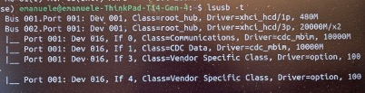

# 5G Sierra Wireless KPI AT ROS1

 Author: [Emanuele Pagliari](https://github.com/Palia95) 

 This ROS1 package gathers the main 5G RF quality indexes from Sierra Wireless 5G modems (`EM9293` and `EM9191`) and publish them in the proper ROS1 topic (`sierra_nr5g`).

## Requirements

 The only requirements are Python3 with its related ROS1 dependencies and `pySerial` installed. Also, a Sierra Wireless 5G modem properly connected to the host computer is needed.

## Forcing Sierra Wireless driver loading

 On `Ubuntu 20.04 LTS`, it is necessary to force the loading of the `Option` driver using the following commands:
```bash
sudo modprobe option
```
 Then, based on the adopted modem, the following command is needed to properly load the Option driver for the Sierra Wireless `EM9293`:
```bash
sudo apt upgrade modemmanager sudo sh -c "echo '1199 90e3' > /sys/bus/usb-serial/drivers/option1/new_id"
```
For the Sierra Wireless `EM9191` instead, the same commands needs the suitable VendorID and ProductID:
```bash
sudo apt upgrade modemmanager sudo sh -c "echo '1199 90d3' > /sys/bus/usb-serial/drivers/option1/new_id"
```
Other modems might need different VID and PID. If the command is successful, the following command should return the `ttyUSB0` and `ttyUSB1` serial ports as available:
```bash
dmesg | grep tty
```
To check if the driver has been properly loaded, use the following command:
```bash
lsusb -t
```
Should return the following output:

