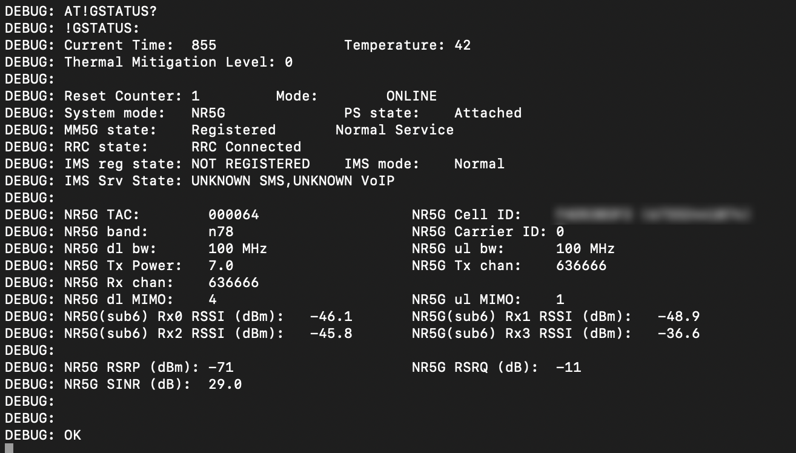

# 5G Sierra Wireless KPI AT ROS1 & ROS2

 Author: [Emanuele Pagliari](https://github.com/Palia95)

 This ROS1 package gathers the main 5G RF quality indexes from Sierra Wireless 5G modems (`EM9293` and `EM9191`) and publish them in the proper ROS1 topic (`sierra_nr5g`).

 The ROS2 porting is available in the ROS2 folder.

## Requirements

 The only requirements are Python3 with its related ROS1 dependencies and `pySerial` installed. Also, a Sierra Wireless 5G modem properly connected to the host computer is needed with a good quality USB-C 3.0 cable.

## First connection 5G modem setup

If the the 5G modem, not only the Sierra Wireless `EM9293` and `EM9191` but also the Quectel RM520GL have never been used on the robotic platform or computer, it might be needed to upgrade both `ModemManager` as well as `NetworkManager`, plus to setup the connection in `NetworkManager`. 

To install and update `ModemManager`, run the following command:
```bash
snap install modem-manager modem-manager
```
To update `NetworkManager`, run the following command:
```bash
sudo apt-get install network-manager
```
A reboot is recommended after the installation of these dependencies.

Once they are installed, the 5G modem is going to be detected and visible from the network setting menu. However, I reccomend to setup the cellular connection and APN using the following command:
```bash
sudo nmcli connection add type gsm ifname '*' con-name '5GSA' apn '5gsa.lulea' connection.autoconnect yes
```
where `con-name '5GSA'` is the name of the connection that you want to add, while `apn '5gsa.lulea'` is the APN for the 5G network at LTU. These parameters must be set accordendly to the cellular network you want to connect to. As an example, Telia parameters APN is `apn 'online.telia.se'`.

## Selecting modem operating mode

The developed ROS1 and ROS2 package in this repository works only to gather 5G KPI. Using this package with 4G network will crash the script or result in no output in the ROS topic, since the parser process only the 5G-related RF metrics. 

Therefore, it is needed to force the modem to `5G SA` only, thus excluding the fallback on `4G LTE` tecnology. In order to do this, after the modem has been setup, it is possible to force the `5G SA` only operating mode trough the following `ModemManager` commands.

First of all, the target modem must be individuated. To do this, the following command can be used:
```bash
mmcli -L
```
It will output the available connected modems, in our case the Sierra Wireless EM9293:
```bash
/org/freedesktop/ModemManager1/Modem/0 [Sierra Wireless] EM9293
```
Then, using its ID, it is possible to force the `5G SA` only modem operating modem likes follow:
```bash
mmcli -m 0 —set-allowed-modes='5g|none'
```
An output should appear based on the used modem.

## Forcing Sierra Wireless driver loading

 On `Ubuntu 20.04 and 22.04 LTS`, it is necessary to force the loading of the `Option` driver using the following commands:
```bash
sudo modprobe option
```
 Then, based on the adopted modem, the following command is needed to properly load the Option driver for the Sierra Wireless `EM9293`:
```bash
sudo sh -c "echo '1199 90e3' > /sys/bus/usb-serial/drivers/option1/new_id"
```
For the Sierra Wireless `EM9191` instead, the same commands needs the suitable VendorID and ProductID:
```bash
sudo sh -c "echo '1199 90d3' > /sys/bus/usb-serial/drivers/option1/new_id"
```
Other modems might need different VID and PID. If the command is successful, the following command should return the `ttyUSB0` and `ttyUSB1` serial ports as available:
```bash
dmesg | grep tty
```
To check if the driver has been properly loaded, use the following command:
```bash
lsusb -t
```
Should return the following output:


A bash script, denoted as `5Gdriverload.sh` is also available to make the process faster. Please use the proper VID and PID based on the modem you are using.

## Output example



## To do

Modify the parser and the publisher to include the nearby cells data as well as 4G LTE data.
